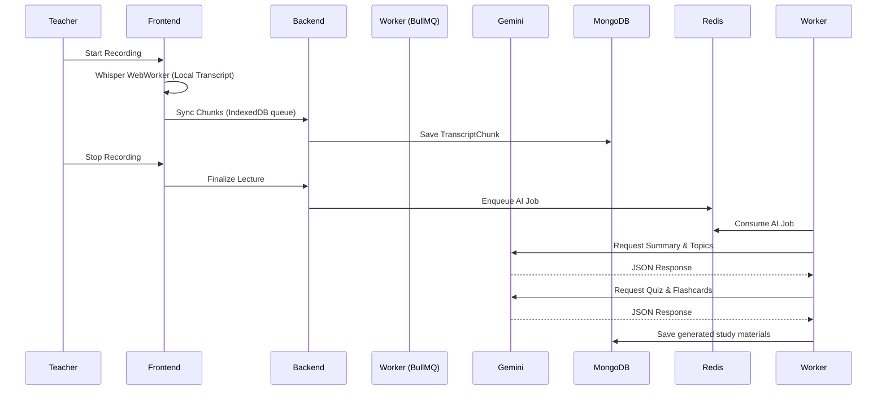

# AI Classroom Platform

A real-time, offline-first web application designed to transform lecture recordings into interactive, AI-powered study materials. This platform utilizes the Google Gemini Flash model to automatically structure long-form video/audio into semantic chapters, quizzes, 3D flashcards, and comprehensive study notes.

## 🌟 Features
- **Offline-First Recording:** Transcribe audio in the browser via Web Worker (Whisper) without waiting for server uploads.
- **Smart Virtuoso Timeline:** 60fps virtualization for thousands of transcript chunks, auto-syncing with media playback.
- **Semantic Chapters:** AI automatically chunks the lecture into distinct timeline topics.
- **Study Workspace:**
  - Auto-generated Multiple Choice Quizzes.
  - Interactive 3D Flashcards with keyboard navigation.
  - Summaries and Topic highlights.
- **Teacher Analytics:** View student engagement and AI processing throughput directly from the dashboard.

## 📸 Screenshots

| Dashboard | Lecture Viewer & Smart Timeline |
|-----------|--------------------------------|
|  |  |

| AI Study Workspace | Generated Quiz |
|--------------------|----------------|
|  |  |

## 🏗 Architecture & Tech Stack

### Tech Stack
- **Frontend:** React, Vite, Zustand, Tailwind CSS, React Virtuoso
- **Backend:** Node.js, Express, MongoDB (Mongoose), BullMQ
- **AI/ML:** Google Gemini 1.5 Flash, Transformers.js (Local Whisper)
- **Queue/Cache:** Redis

### Why This Architecture?
The platform follows an **Async AI worker pattern**. By offloading all expensive LLM operations (Embeddings, Summaries, Quizzes) to a BullMQ worker via Redis, the primary Node.js thread remains unblocked, ensuring zero dropped frames when teachers upload chunked audio. 
Virtuoso was selected on the frontend to prevent DOM bloat; rendering thousands of transcript nodes would otherwise crush browser memory. Zustand strictly manages the state locally without cascading Context updates.

## 📸 System Diagrams

### Recording & Processing Lifecycle


## 🚀 Setup & Localhost Development

### Prerequisites
- Node.js (v18+)
- MongoDB running locally (default: `mongodb://localhost:27017/ai_classroom`)
- Redis running locally (default: `127.0.0.1:6379`)
- Google Gemini API Key

### Installation

1. **Install Dependencies**
   ```bash
   npm install
   ```

2. **Environment Configuration**
   Copy `.env.example` to `apps/backend/.env`:
   ```bash
   PORT=4000
   NODE_ENV=development
   MONGODB_URI=mongodb://localhost:27017/ai_classroom
   REDIS_HOST=127.0.0.1
   REDIS_PORT=6379
   JWT_SECRET=local_development_secret_key
   GEMINI_API_KEY=your_key_here
   ```

3. **Seed Database (Demo Mode)**
   This will instantly generate a highly realistic "Consensus Algorithms" lecture containing AI summaries and quizzes without consuming your Gemini quotas.
   ```bash
   npm run seed
   # For a clean slate: npm run seed:reset
   ```

4. **Run Platform**
   Using `concurrently`, spin up the frontend and backend simultaneously:
   ```bash
   npm run dev
   ```

## 🎓 Demo Flow

1. Go to `http://localhost:5173`
2. **Log in** as `student@demo.com` (password: `password123`)
3. **Open** "Introduction to Distributed Systems"
4. **Click** the "Understanding Consensus: Paxos and Raft" lecture.
5. **Explore** the Smart Timeline on the left. Click transcript chunks to "seek" the media.
6. **Toggle** "Study Mode" in the top right to collapse the timeline.
7. **Interact** with the generated 3D Flashcards and Quiz on the right-hand panel.

## ⚠️ Known Limitations
- VAD (Voice Activity Detection) in the browser can occasionally split sentences awkwardly if the speaker pauses for exactly 2 seconds.
- The platform relies entirely on `ffmpeg-static` for backend processing; extremely large files might encounter Node.js memory limits.
- Currently, no centralized logging service (e.g. Datadog) is integrated.

## 🛣 Future Roadmap
- **Deployment:** Containerize via Docker and deploy on AWS ECS or Render.
- **Multi-modal AI:** Pass actual video frames to Gemini 1.5 Pro to index visual slide content alongside the audio.
- **RAG Assistant:** Enable the Q/A chatbox using vector embeddings (Pinecone/Qdrant).
