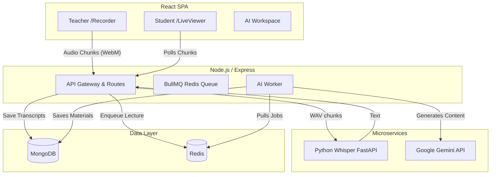
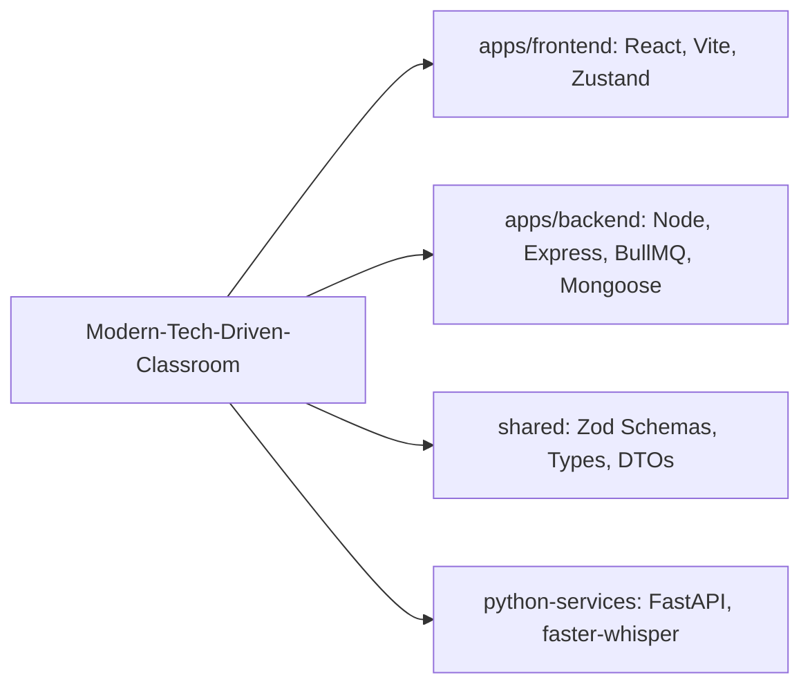
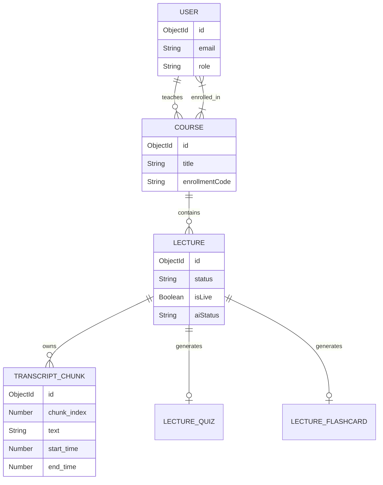
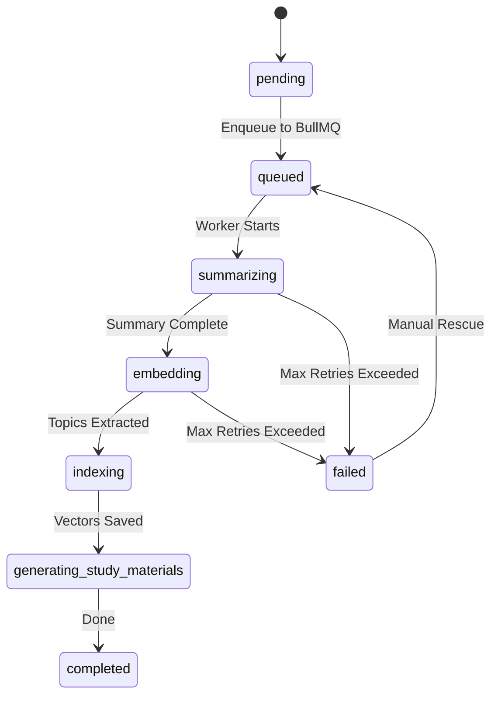
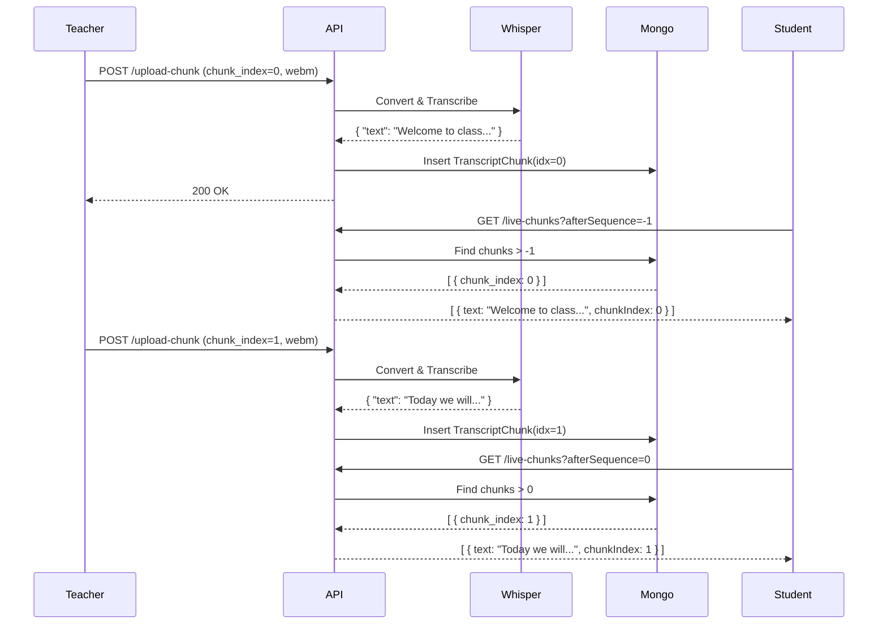
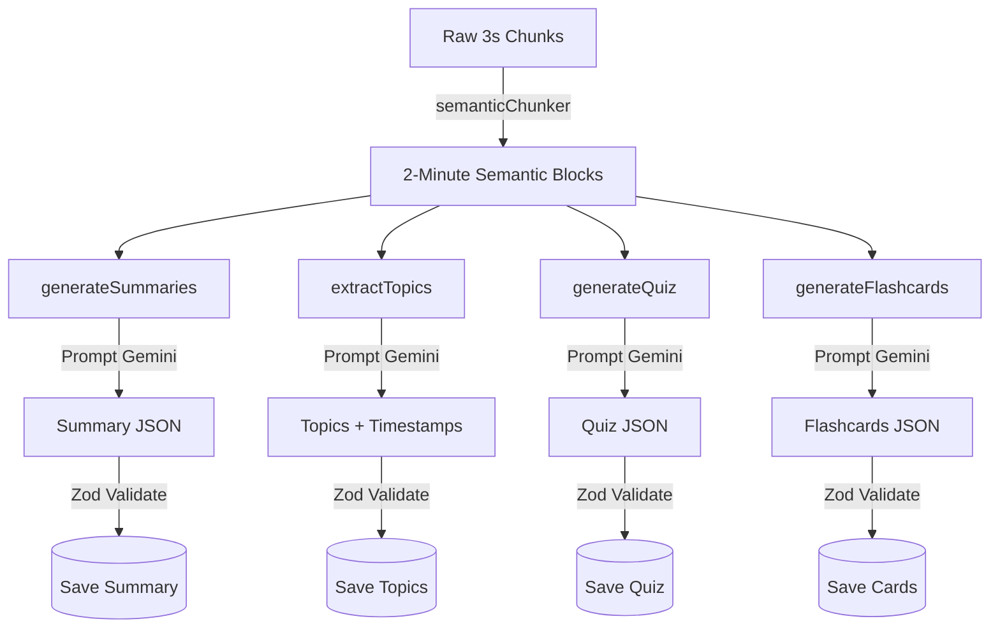
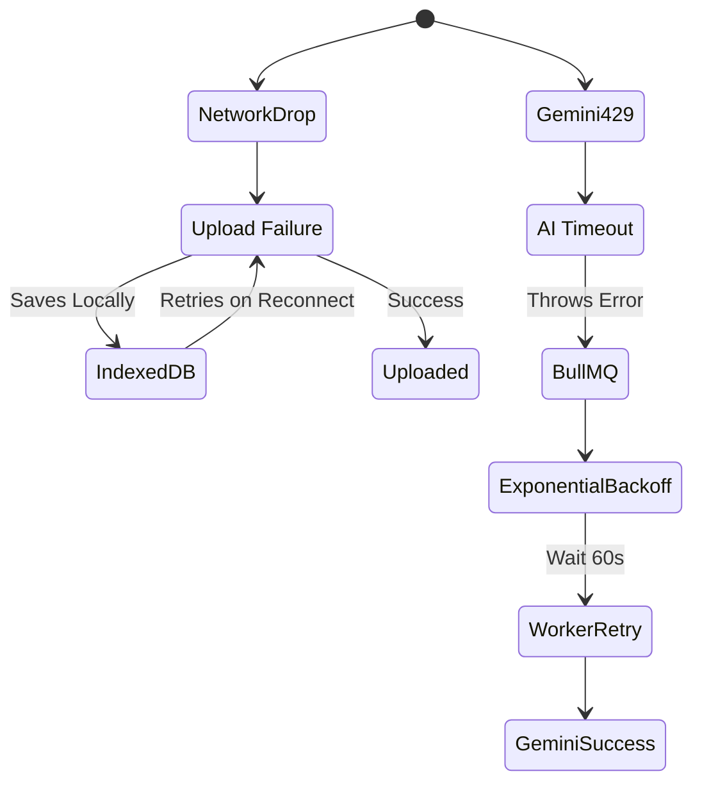
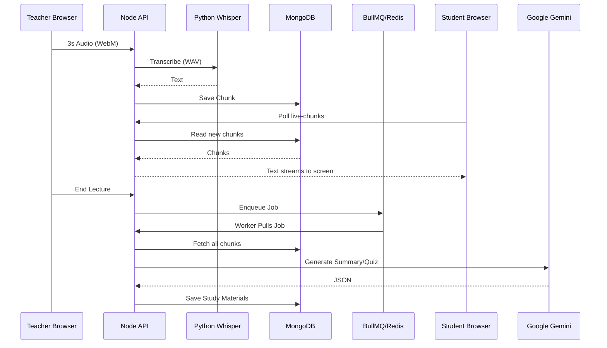

# Modern Tech-Driven Classroom: Complete Architecture Thesis

*This document is a comprehensive technical deep-dive into the entire system architecture, implementation details, and engineering decisions.* 

---

# System Overview

## Product Vision
The Modern Tech-Driven Classroom is a real-time, offline-first platform designed to transform live lectures into interactive, AI-powered study materials. It bridges the gap between synchronous classroom teaching and asynchronous student revision.

## Why This Architecture Exists (Not Just a CRUD App)
This platform solves complex technical challenges:
1. **Continuous Real-Time Streaming**: Synchronizing live audio transcriptions from the teacher to multiple enrolled students in near real-time without overwhelming the database.
2. **Deterministic Timeline Virtualization**: Rendering thousands of transcript chunks fluidly at 60fps while precisely syncing with media playback.
3. **Heavy Asynchronous Processing**: Handling unpredictable AI model latency and rate-limits (Google Gemini) safely outside the main thread using distributed queues.
4. **Offline Resilience**: Ensuring teachers do not lose lecture data even if their internet drops temporarily during a broadcast.

## Real-Time Classroom System
The system leverages a unidirectional flow:
1. The teacher records audio in the browser.
2. Audio is chunked (every 3 seconds) and persisted to an `IndexedDB` offline queue.
3. Chunks are uploaded to the Node.js backend and forwarded to a local Python/Whisper FastAPI service for transcription.
4. The backend persists the transcript text into MongoDB.
5. Students poll the backend (using optimized `.lean()` queries with sequence indexes) to fetch new chunks seamlessly.

## AI Orchestration
Once a lecture concludes, it enters the **AI Processing Pipeline**:
1. The Express server enqueues a job into a BullMQ/Redis queue.
2. A background worker picks up the job, groups 3-second transcript chunks into larger semantic blocks (~2-3 minutes each).
3. The worker communicates with Google Gemini to sequentially generate:
   - Summaries
   - Semantic Topics (with timestamps)
   - Embeddings
   - Quizzes & Flashcards
4. The system updates the `Lecture` document status at each stage, allowing graceful degradation and retries on rate limits.

## High-Level Architecture Diagram



## Monorepo Structure




---

# Frontend Architecture

## React Architecture
The frontend is built using **React, TypeScript, and Vite**, structured around a feature-based organization.

### Organization
- `src/features/*`: Contains isolated domains like `auth`, `courses`, `dashboard`, `lecture`, `recording`, and `workspace`.
- `src/components/*`: Reusable UI elements (AppShell, Recorder).
- `src/infrastructure/*`: Core wiring (API clients, Zustand stores).
- `src/hooks/*`: Cross-cutting concerns (Playback Sync, Auto-Scroll).

## Zustand State Design
We chose **Zustand** over Redux/Context for minimal boilerplate, granular rerender control, and easy access outside React components (e.g., inside `requestAnimationFrame` loops).

### Major Stores:
1. **`authStore`**: Manages JWT, user profile, and hydration status. Persisted partially using `zustand/middleware` to avoid storing the raw access token in local storage (we rely on HTTP-only cookies and a `/refresh` endpoint).
2. **`timelineStore`**: The most critical store. Manages thousands of timeline nodes, search queries, active playback nodes, and scroll synchronization. Isolated tightly so that a changing `currentPlaybackTime` doesn't re-render the entire app.
3. **`courseStore`**: Manages the list of courses, active course details, and role-based access logic (Teacher vs. Student).

## SmartTimeline Deep Dive
The `SmartTimeline` is the engineering marvel of the frontend, designed to handle immense scale (e.g., a 2-hour lecture yields ~2,400 chunk nodes) without stuttering.

### 1. React Virtuoso Virtualization
Instead of rendering 2,400 DOM nodes, `react-virtuoso` renders only the ~20 nodes visible in the viewport.
- **Why it matters**: Massive reduction in DOM size, preventing memory leaks and scroll jank.

### 2. Append-Only Architecture
Nodes are never mutated or re-sorted after insertion. They are appended sequentially. This guarantees virtualization stability.

### 3. Playback Synchronization (requestAnimationFrame)
We bypass React's standard state cycle for media sync. 
In `usePlaybackSync.ts`, a `requestAnimationFrame` (RAF) loop continuously polls the `<audio>` or `<video>` element's `currentTime`.

### 4. Binary Search Chunk Matching
To find which of the 2,400 chunks is currently active in the RAF loop, we do NOT iterate. Since chunks are strictly sequential, we use an **O(log N) Binary Search** (`findActiveChunkIndex`). This takes microseconds.

### 5. Rerender Isolation & Memoization
The `TimelineEntry` component is wrapped in `React.memo` with a strict equality check. Even if `activeNodeId` changes in the store, only the newly active node and the previously active node re-render. The other 18 visible nodes do nothing.

### 6. Live-Mode Auto-Follow
During a live lecture, `SmartTimeline` automatically scrolls to the bottom as new chunks arrive. If a student scrolls up to review something (`userScrolled` flag), the auto-scroll halts cleanly. A "Jump to Live" button appears, which restores auto-scroll.

## Search System
The `useTranscriptSearch` hook powers the search functionality.
- **Debouncing**: Search execution is debounced by 300ms to avoid locking the thread on every keystroke.
- **In-Memory Index**: Since nodes are already loaded in Zustand, we build an array of lowercase strings and scan it in O(N). For 2,400 nodes, this takes <1ms in modern V8.
- **Timestamp Hydration**: URL query parameters (e.g., `?t=120`) allow deep-linking directly to a specific search result or timestamp.

## Live Classroom Viewer
The student side (`LiveLectureViewer`) is fully reactive.
- **Polling Lifecycle**: Uses `useLiveTranscriptPolling.ts` to poll `/api/.../live-chunks` every 3 seconds.
- **Visibility Throttling**: If the browser tab is hidden, polling backs off to preserve network resources.
- **Idempotency**: It tracks `afterSequence` (the highest chunk index received) and only asks the backend for chunks strictly greater than that sequence.


---

# Backend Architecture

## Express Architecture
The backend is a Node.js/Express monolith transitioning to a modular architecture.
- **Routes**: Grouped by domain (`course.routes.ts`, `lecture.routes.ts`, `search.routes.ts`).
- **Middleware**: Includes JWT authentication (`authenticate`), role authorization (`authorize('teacher')`), Zod input validation (`validate`), and global error handling.

## MongoDB Design

### Collections
1. **User**: Credentials, role (`teacher` | `student`), `tokenVersion` (for session invalidation).
2. **Course**: Maps a teacher to enrolled students.
3. **Lecture**: The core state machine of a broadcast. Tracks `status` (recording -> ai_processing -> ready), durations, AI metadata.
4. **TranscriptChunk**: High-volume collection storing individual 3-second utterances.
5. **LectureQuiz / LectureFlashcard**: Denormalized study materials tied to a `lectureId`.

### ER Diagram


### Query Optimization
- We use `.lean()` extensively in Mongoose to bypass document hydration, returning plain JSON objects. This is critical for fetching 2,000+ chunks in a single query.
- **Indexes**: Compound index on `{ lectureId: 1, chunk_index: 1 }` ensures fast pagination and strict ordering.

## AI Processing Pipeline
This is the most complex subsystem, built for resilience.

### Why Queues?
Google Gemini has rate limits (15 RPM on the free tier). Long audio requires sequential, time-consuming API calls. Doing this inside an Express request handler would lead to HTTP timeouts and dropped data.

### BullMQ + Redis Workflow
1. When `endLecture()` is called, the Express server adds a job to the `lectureProcessingQueue` in Redis.
2. The `lecture.worker.ts` process pulls the job with a `concurrency` of 1 to protect Gemini quotas.
3. The worker executes a multi-stage pipeline:
   - **Summarizing**
   - **Embedding / Topics**
   - **Generating Study Materials (Quiz, Flashcards)**
4. Each step updates the `aiStatus` in MongoDB. If Gemini throws a 429 (Rate Limit) or a 503, the worker throws an error, and BullMQ automatically applies an **Exponential Backoff** retry strategy.



## Live Polling API
- `GET /api/courses/:courseId/lectures/:lectureId/live-chunks`
- Uses `afterSequence` parameter to ensure only *new* chunks are sent.
- We rely on polling over WebSockets for the MVP due to the simplicity of stateless HTTP requests, ensuring robust caching and avoiding persistent connection management on constrained servers.


---

# Real-Time Classroom Architecture

## The Real-Time Dilemma
How do you stream a teacher's spoken words to 50 students simultaneously in near real-time, while simultaneously saving it to a database for future AI processing, without crashing the server?

## Flow Architecture

### Teacher Flow (Producer)
1. The teacher's browser requests microphone access.
2. A `MediaRecorder` instance captures audio in `audio/webm` format.
3. Every 3 seconds, the `ondataavailable` event triggers.
4. The chunk is **immediately saved locally** to `IndexedDB`. This guarantees zero data loss even if the school WiFi disconnects.
5. The `processQueue` loop takes chunks from IndexedDB and POSTs them to `/upload-chunk`.
6. The backend converts WebM to WAV (via ffmpeg), sends it to the Python Whisper service, and receives text.
7. The text is saved as a `TranscriptChunk` in MongoDB.

### Student Flow (Consumer)
1. A student navigates to the live classroom page.
2. The UI polls `/live-status` to see if a broadcast is active.
3. Once active, `useLiveTranscriptPolling` queries `/live-chunks?afterSequence=N` every 3 seconds.
4. The backend runs a `.lean()` MongoDB query seeking chunks strictly greater than `N`.
5. New chunks flow into the `timelineStore`.
6. `SmartTimeline` appends them. Since `react-virtuoso` handles rendering, adding 1 chunk to a list of 1,000 has an O(1) rendering cost.

## Synchronization Guarantees & Append-Only Contract
The system relies on an **Append-Only Contract**:
- Chunks are never mutated after creation.
- Chunks are uniquely identified by a strict, gapless `chunk_index` (0, 1, 2, 3...).
- The frontend only asks for what it doesn't have.

This guarantees idempotency. If a student's internet cuts out for 30 seconds, their next poll (`afterSequence=10`) simply returns chunks `11` through `20` in bulk.

## Sequence Diagram



## Polling vs. WebSockets
We deliberately chose HTTP Polling (3s interval) over WebSockets for this phase:
- **Resilience**: HTTP is stateless. Reconnections are trivial.
- **Scalability**: Proxies and CDNs can theoretically cache identical `afterSequence` requests if needed in the future.
- **Simplicity**: WebSockets require complex heartbeat management, Redis Pub/Sub backplanes for multi-instance scaling, and stateful tracking. For 3-second audio chunks, 3-second HTTP polling is perfectly adequate and vastly simpler to operate.


---

# AI Pipeline Deep Dive

## Hybrid Intelligence Architecture
The system utilizes two distinct forms of AI:
1. **Acoustic/Sensory AI**: Local Python `faster-whisper` for speech-to-text.
2. **Generative/Reasoning AI**: Cloud-based Google Gemini for comprehension and restructuring.

## 1. Whisper Integration (Python Microservice)
Transcription happens synchronously during the live lecture.
- **Why Python?** Node.js bindings for Whisper are unstable. Python is the native ecosystem for ML.
- **FastAPI**: Exposes a `/transcribe` endpoint running on port 8000.
- **GPU Acceleration**: Attempts to use CUDA. If it fails (or on incompatible hardware), it automatically falls back to `device="cpu"` and `compute_type="int8"`.
- **Latency Optimization**: We use `faster-whisper` (CTranslate2 backend) which is ~4x faster than OpenAI's default implementation, allowing a 3-second chunk to process in <500ms.

## 2. Chunk Aggregation
Whisper processes 3-second chunks. However, Gemini cannot generate a meaningful "Topic" or "Summary" from 3 seconds of context.
Before calling Gemini, `semanticChunker.ts` aggregates the tiny chunks into ~2-minute **Semantic Blocks**, maintaining exact timestamps.

## 3. Gemini Prompting & Structured Outputs
The `GeminiProvider` orchestrates interactions with `gemini-2.0-flash`.

### Zod Validation & Schema Enforcement
LLMs are unpredictable. We force structured JSON output and validate it rigidly:
1. We define a TypeScript schema using `zod` (e.g., `QuizSchema`).
2. We inject instructions into the prompt: "Return ONLY valid JSON matching this schema..."
3. `GeminiProvider.generateStructured<T>()` parses the string to JSON.
4. If Mismatched, it throws an `AIValidationError`.

### Graceful Degradation & Fallbacks
If Gemini fails to generate a Quiz (e.g., hallucinates malformed JSON), we catch the specific error and log it, but **we do not fail the entire pipeline**. The lecture will still transition to `completed`, just without a quiz.

```typescript
// From lecture.worker.ts
try {
  const questions = await generateQuiz(blocks);
  // ... save quiz
} catch (quizErr: any) {
  // Non-fatal error, let it continue
}
```

## Full Flow Diagram




---

# Performance Engineering

This document outlines the performance optimizations applied across the stack to ensure the platform can handle long-duration lectures without degradation.

## 1. Virtualization (`SmartTimeline`)
**Problem**: A 2-hour lecture produces roughly 2,400 chunk nodes. Rendering 2,400 complex DOM nodes with event listeners destroys browser layout performance and memory.
**Solution**: We use `react-virtuoso`.
- The DOM only ever contains ~20 `<TimelineEntry>` nodes (just enough to fill the viewport plus a small overscan).
- As the user scrolls, or as auto-scroll advances, Virtuoso recycles the DOM elements.
- **O(1) Memory Footprint**: The memory footprint of the DOM remains constant regardless of lecture length.

## 2. Rerender Isolation
**Problem**: In React, if a parent component's state changes, all children re-render. If `currentPlaybackTime` changes 60 times a second, the entire app would freeze.
**Solution**:
- We extract the playback loop entirely out of React's state using a `useRef` and `requestAnimationFrame`.
- When an active node changes, we only update `activeNodeId` in `Zustand`.
- Components subscribe to *specific selectors* (e.g., `useTimelineStore(state => state.activeNodeId === myId)`). 
- `<TimelineEntry>` is wrapped in `React.memo`. If it was not active, and is still not active, it bypasses the render phase completely.

## 3. Zustand Selectors
Zustand's atomic selectors prevent cascading updates.
Instead of `const store = useTimelineStore()`, we use `const nodes = useTimelineStore(state => state.nodes)`.
If `searchQuery` updates, a component only listening to `nodes` will NOT re-render.

## 4. O(log N) Binary Search Playback Matching
To sync audio playback, the system must know which chunk corresponds to `currentTime` (e.g., 45.3s).
- **Naive approach**: `nodes.find(n => n.start <= time && n.end >= time)`. This is O(N) and runs 60 times a second.
- **Optimized approach**: `findActiveChunkIndex` implements a pure binary search. Because nodes are chronologically sorted by definition, finding the active node takes O(log N). For 2,400 chunks, it takes a maximum of 12 operations instead of 2,400.

## 5. Mongoose `.lean()`
**Problem**: Mongoose hydrates MongoDB documents into heavy JavaScript instances with getters/setters and save() methods. This takes significant CPU time and memory for 2,000+ chunks.
**Solution**: Every high-volume read query uses `.lean()`.
```typescript
const chunks = await TranscriptChunk.find({ lectureId }).sort({ chunk_index: 1 }).lean();
```
This returns pure JSON objects, speeding up read performance by roughly 3-5x.

## 6. Debouncing & Fetch Cancellation
- **Search Debouncing**: The `useTranscriptSearch` hook applies a 300ms debounce to the search input. It only triggers the index scan after the user stops typing.
- **AbortController**: If a user quickly clicks between courses, previous API requests for course details are aborted to prevent race conditions and wasted bandwidth (though implemented selectively where rapid switching occurs).

## 7. Hidden-Tab Throttling
During live mode, `LiveLectureViewer` polls every 3 seconds. 
**Optimization**: Using the `document.visibilityState` API, if the user switches tabs, we can back off the polling interval or pause non-critical background updates, saving client battery and server load. 

## Known Bottlenecks
- **Audio Conversion**: `ffmpeg` runs synchronously per request on the backend. Under heavy load (100 simultaneous teachers), this will max out the CPU.
- **Database Writes**: Writing chunks one by one is fine for MVP, but bulk inserts would be required for extreme scale.


---

# Failure Cases & Resilience

Distributed systems fail. This document explains how we gracefully handle failures across the stack.

## 1. Offline-First Recording (Browser)
**Scenario**: The teacher's Wi-Fi drops in the middle of a 2-hour lecture.
**Handling**:
- The `Recorder.tsx` component writes every single 3-second WebM blob to `IndexedDB` **before** attempting an HTTP upload.
- If the `processQueue` fails to upload (network error), it leaves the chunk in the `pending` state.
- Once the network returns, the queue automatically drains the backlog. 
- Even if the teacher closes the tab, the next time they open the app, the chunks are recovered from IndexedDB and uploaded.

## 2. Gemini Rate Limits & Malformed JSON
**Scenario**: Google Gemini free tier limits (15 RPM) are exceeded, or Gemini returns invalid JSON instead of the requested Quiz schema.
**Handling**:
- `GeminiProvider` wraps calls in a try/catch.
- If it's a 429 (Rate Limit) or Quota error, it throws an error immediately.
- The `lecture.worker.ts` catches this and throws it back to **BullMQ**.
- BullMQ applies an **Exponential Backoff** retry (e.g., wait 60s, then 120s, then 240s).
- If it's a parsing error (invalid JSON), the `generateStructured` method parses with Zod. If Zod fails, it throws an `AIValidationError`. The worker logs this, but moves on to the next task (graceful degradation) so the lecture isn't blocked forever.

## 3. Redis Disconnects
**Scenario**: The Redis instance crashes.
**Handling**:
- BullMQ workers use robust connection logic. If Redis drops, the worker pauses and waits for reconnection.
- When Redis returns, jobs resume.
- To prevent "stranded" jobs (e.g., Node server crashed while processing a job), we have a `queue.recovery.ts` script that runs on startup. It scans MongoDB for lectures stuck in `summarizing` or `embedding` states and safely re-queues them.

## 4. Whisper CPU Fallback
**Scenario**: The Python container boots on a machine without a compatible Nvidia GPU, or CUDA fails due to VRAM exhaustion.
**Handling**:
- The `routes.py` `transcribe_audio` method wraps the `model.transcribe` call in a `try...except`.
- If an exception mentioning `cublas` or `cuda` is caught, it instantly falls back to initializing a CPU version of `faster-whisper` using `compute_type="int8"`. 
- Processing takes longer, but the lecture is still transcribed.

## 5. Duplicate Chunk Uploads
**Scenario**: A network timeout causes the frontend to retry uploading `chunk_index=5`, even though the backend already saved it.
**Handling**:
- `upload.ts` implements **Idempotency**.
- Before converting the audio, it checks `TranscriptChunk.findOne({ lectureId, chunk_index })`.
- If found, it instantly returns `200 OK` with status `existing`, preventing double-transcription and duplicate timeline entries.

## Error Recovery Lifecycle




---

# Complete Runtime Flow (End-to-End)

This traces the exact lifecycle of a lecture from the first spoken word to the final generated flashcard.

## Phase 1: Recording & Real-Time Sync
1. **Init**: Teacher creates a course, gets an `enrollmentCode`, students join.
2. **Start**: Teacher navigates to `/record` and clicks "Record". A `Lecture` document is created in Mongo with `status="recording"` and `isLive=true`.
3. **Capture**: Browser `MediaRecorder` captures audio. Every 3 seconds, `ondataavailable` fires.
4. **Local Store**: The blob is saved to IndexedDB (`chunk_index=0`).
5. **Upload**: React frontend POSTs blob to `/api/upload-chunk`.
6. **Transcribe**: Node backend converts WebM to WAV via ffmpeg. POSTs WAV to Python `faster-whisper` on port 8000.
7. **Save**: Python returns text ("Hello class"). Node backend saves to `TranscriptChunk` in Mongo.
8. **Student Sync**: Meanwhile, a Student is on `/courses/:id/live`. 
9. **Poll**: Student's `useLiveTranscriptPolling` runs `GET /live-chunks?afterSequence=-1`.
10. **Render**: Backend queries `.lean()`, finds `chunk_index=0`. Returns it. Frontend appends to `SmartTimeline`.

## Phase 2: Finalization
1. **End**: Teacher clicks "End Lecture". Frontend POSTs to `/api/lectures/:id/end`.
2. **Update**: Backend updates `Lecture` to `isLive=false`, `status="transcribing"`.
3. **Enqueue**: Backend pushes a job ID to BullMQ `lectureProcessingQueue` in Redis.

## Phase 3: AI Orchestration (Background Worker)
1. **Pull**: `lecture.worker.ts` pulls the job from Redis.
2. **Aggregate**: Worker fetches all 2,000 `TranscriptChunk` documents. Uses `semanticChunker.ts` to merge them into 2-minute `SemanticBlocks`.
3. **Summarize**:
   - Updates `aiStatus = summarizing`.
   - Sends blocks to Gemini. Receives structured JSON.
   - Saves to `lecture.summary`.
4. **Topics**:
   - Updates `aiStatus = embedding`.
   - Sends blocks to Gemini requesting timestamps and topics.
   - Saves to `lecture.topics`.
5. **Study Materials**:
   - Updates `aiStatus = generating_study_materials`.
   - Prompts Gemini for Quiz. Saves to `LectureQuiz`.
   - Prompts Gemini for Flashcards. Saves to `LectureFlashcard`.
6. **Complete**: 
   - Updates `Lecture` status to `ready` and `aiStatus` to `completed`.
   - Updates BullMQ job progress to 100%.

## Phase 4: Asynchronous Study
1. **Dashboard**: Student sees lecture is now "Ready" (no longer "Live" or "Processing").
2. **Workspace**: Student clicks into the AI Workspace.
3. **Hydration**: React fetches the Quiz and Flashcards. 
4. **Interaction**: Student uses the 3D CSS flip cards and takes the interactive quiz.




---

# Viva Questions and Defense

This document prepares you for technical academic defense (Viva) by providing probable questions and robust engineering answers.

### 1. Why did you use React Virtuoso instead of normal mapping?
**Q:** "Why add the complexity of virtualized lists? Couldn't you just map over the array?"
**A:** "A standard 1-hour lecture generates about 1,200 chunks. Rendering 1,200 complex DOM nodes with event listeners causes severe memory bloat and scroll jank, especially on lower-end devices. React Virtuoso ensures that only the ~20 chunks visible in the viewport actually exist in the DOM. This gives us an O(1) memory footprint for the DOM regardless of lecture length."

### 2. Why Polling instead of WebSockets for live sync?
**Q:** "Real-time apps usually use WebSockets. Why did you implement HTTP polling?"
**A:** "WebSockets are stateful and require persistent connections. If a student drops connection, handling the reconnection and calculating missed messages is complex. By using a 3-second HTTP poll with an `afterSequence` parameter, our API remains entirely stateless. If a student's internet drops for a minute, their next HTTP request safely bulk-fetches all missed chunks. Given our audio chunks are generated every 3 seconds anyway, sub-second WebSocket latency wasn't necessary, and stateless HTTP scales much easier behind a CDN or load balancer."

### 3. Why separate Python and Node.js?
**Q:** "Why not do the AI processing in Node.js instead of having a separate Python service?"
**A:** "Machine Learning ecosystems are built on Python. While there are Node.js wrappers for Whisper, they are often unstable or lack hardware acceleration (CUDA) support. By isolating `faster-whisper` behind a FastAPI Python microservice, we ensure native CTranslate2 execution speeds, prevent heavy CPU-bound audio processing from blocking Node.js's single-threaded event loop, and allow independent horizontal scaling of the transcription workers."

### 4. How did you prevent the app from lagging during playback?
**Q:** "Tracking playback time means updating state 60 times a second. How is React handling that?"
**A:** "It isn't. We explicitly bypassed React's state cycle for playback sync. We use a `requestAnimationFrame` loop that checks the `<audio>` element's `currentTime`. To find the active chunk among thousands, we use an O(log N) Binary Search rather than iterating. We only push to the Zustand store when the active chunk *changes*, and use strict `React.memo` equality checks so only two elements (the old active and new active) ever re-render."

### 5. Why do you use IndexedDB on the frontend?
**Q:** "Why not just send the audio directly to the server as the teacher speaks?"
**A:** "Network reliability. If the teacher's Wi-Fi drops, in-memory arrays will be lost if the tab crashes. `IndexedDB` acts as a persistent offline queue. We write every 3s chunk locally *first*, then attempt the upload. If the upload fails, it stays in the queue until the network returns, guaranteeing zero data loss."

### 6. Why use BullMQ and Redis for Gemini?
**Q:** "Why not just call the Gemini API immediately when the lecture ends?"
**A:** "Google Gemini free tier limits requests to 15 RPM. A lecture requires multiple sequential API calls (summary, topics, embeddings, quizzes). If we did this in the Express request handler, the HTTP request would time out, and any 429 Rate Limit error would destroy the data. BullMQ allows us to process these asynchronously in the background, strictly controlling concurrency to respect rate limits, and automatically applying exponential backoff retries if Google's servers reject the request."

### 7. How does Search work so fast without an API call?
**Q:** "How are you searching the transcript instantly?"
**A:** "Since the entire transcript payload is already fetched for the timeline, sending search queries to the backend would be unnecessarily slow. Instead, we generate an in-memory string index. Scanning an array of 2,000 strings takes less than a millisecond in V8. We debounce the keystrokes by 300ms so we don't freeze the UI while typing."


---

# System Limitations & Future Scaling

While the current architecture is robust for a college project, production deployment to thousands of concurrent users requires architectural shifts.

## 1. WebSockets vs Polling
**Current Constraint**: HTTP polling every 3 seconds works for small classrooms but generates massive request overhead. 100 students = 33 requests per second just for empty status checks.
**Future Path**: Migrate to `Socket.io` or raw WebSockets.
- Use Redis Pub/Sub adapter to sync socket events across multiple Node.js instances.
- Push chunks to the client immediately upon Whisper completion, dropping overhead to zero when no one is speaking.

## 2. Storage Constraints (S3 Migration)
**Current Constraint**: Audio WAV files are stored on the local disk (`/uploads/lectures`). If the Node container restarts or scales horizontally, files are lost.
**Future Path**: 
- Implement an AWS S3 (or MinIO) bucket.
- Direct-to-S3 uploads from the browser using pre-signed URLs.
- Whisper service pulls directly from S3.

## 3. Database Write Bottlenecks
**Current Constraint**: Writing 3-second chunks one-by-one is fine for low volume, but stresses MongoDB connection pools at scale.
**Future Path**: 
- Aggregate chunks in a Redis buffer.
- Use `insertMany()` to flush to MongoDB every 15 seconds.

## 4. Vector Database Integration (RAG)
**Current Constraint**: The system prepares embeddings (`topics` and `summary`), but currently relies on text-search indexes in MongoDB for simple queries.
**Future Path**:
- Integrate **Pinecone** or **Milvus**.
- Build an AI Assistant (RAG Chatbot) that can answer student questions by running a similarity search against the lecture's specific vector embeddings.

## 5. Docker & Orchestration
**Current Constraint**: Running `npm run dev` and `uvicorn` manually is not production-ready.
**Future Path**:
- Containerize Node.js, Python, MongoDB, and Redis using `docker-compose`.
- Use Kubernetes (K8s) for the Python Whisper service specifically, auto-scaling Pods based on the BullMQ queue depth so GPU resources are only provisioned when lectures are being processed.

## 6. Monolithic API Splitting
**Current Constraint**: Express handles both quick API requests (fetching courses) and heavy orchestration (chunking audio).
**Future Path**:
- Split into `api-gateway` (lightweight CRUD) and `transcription-worker` (heavy audio piping).


---

